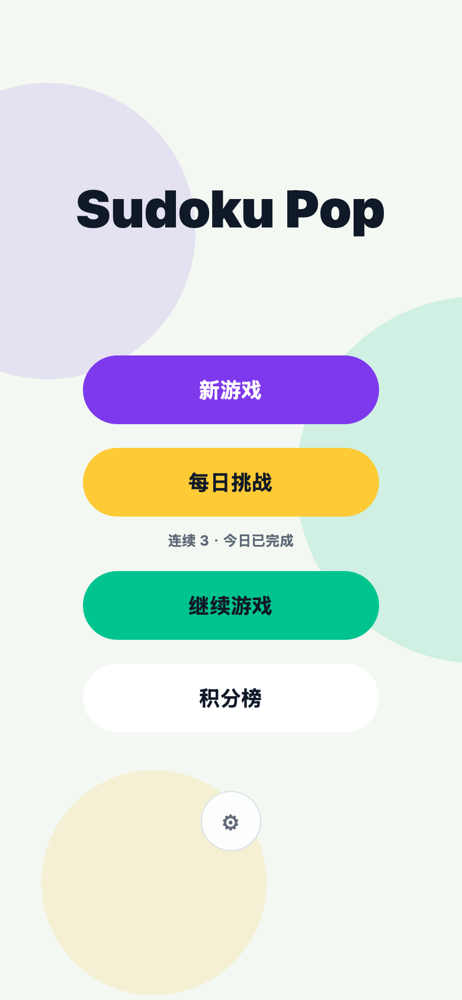
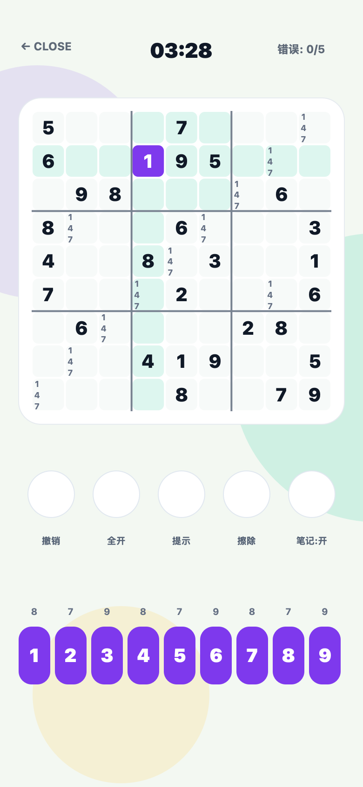
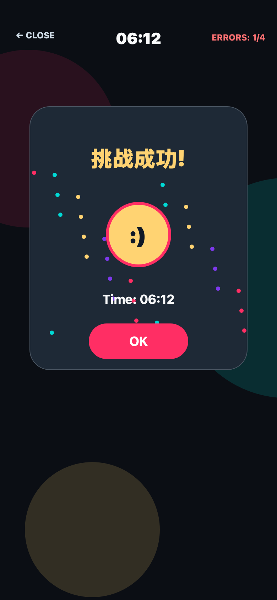

<div align="center">

# Sudoku Pop

轻量、彩色、适合日常逻辑训练的数独 App。

A lightweight, colorful Sudoku app for everyday logic practice.


[中文](#中文) · [English](#english) · [Screenshots](#screenshots) · [Build](#build)

</div>

## Screenshots

<p align="center">
  
  
  
</p>

## 中文

Sudoku Pop 是一款轻量级数独游戏，主打清爽界面、快速开局和日常逻辑训练。

产品保持克制：不需要账号，不申请敏感权限，不用复杂系统打断玩家。打开就能玩，是第一优先级。

### 核心功能

- 经典 9x9 数独
- 多个难度
- 每日挑战
- 连续挑战记录
- 笔记模式
- 提示
- 撤销
- 成绩记录
- 亮色/暗色主题
- 简体中文、繁体中文、英文、日文

Android 包名：

```text
com.ewstudio.sudokupop
```

### 发布策略

首版以稳定上架和基础体验为主：

- 免费应用
- 不包含广告
- 不收集个人数据
- 不需要账号
- 不申请敏感权限
- 先走内部测试/封闭测试

隐私政策草稿：`PRIVACY_POLICY.md`

上架资料和后续计划：`GOOGLE_PLAY_LAUNCH_PLAN.md`

### 路线图

- 完成 Google Play 首版测试发布
- 优化统计和完成反馈
- 增加胜利分享图
- 增加更多主题皮肤
- 在留存稳定后，再评估激励广告或去广告内购

## English

Sudoku Pop is a lightweight Sudoku game focused on a clean interface, fast play, and everyday logic practice.

The product stays intentionally simple: no account required, no sensitive permissions, and no heavy systems getting in the player's way. Open the app, start a puzzle, play.

### Core features

- Classic 9x9 Sudoku
- Multiple difficulty levels
- Daily challenge
- Daily streak tracking
- Notes mode
- Hints
- Undo
- Best records
- Light and dark themes
- Simplified Chinese, Traditional Chinese, English, and Japanese

Android package name:

```text
com.ewstudio.sudokupop
```

### Release strategy

The first release is focused on a stable launch and a clean baseline experience:

- Free app
- No ads
- No personal data collection
- No account required
- No sensitive permissions
- Start with internal or closed testing

Privacy policy draft: `PRIVACY_POLICY.md`

Launch notes and next steps: `GOOGLE_PLAY_LAUNCH_PLAN.md`

### Roadmap

- Complete the first Google Play test release
- Improve stats and completion feedback
- Add a shareable win screen
- Add more visual themes
- Evaluate rewarded ads or an ad-free purchase after retention is stable

## Build

Build the AAB:

```bash
JAVA_HOME="/Applications/Android Studio.app/Contents/jbr/Contents/Home" ./gradlew :app:bundleRelease
```

Run tests:

```bash
JAVA_HOME="/Applications/Android Studio.app/Contents/jbr/Contents/Home" ./gradlew :app:testDebugUnitTest
```

AAB output:

```text
app/build/outputs/bundle/release/app-release.aab
```
